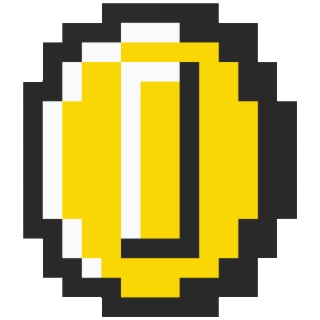

<div id="top"></div>

<!-- PROJECT SHIELDS -->
[![Contributors][contributors-shield]][contributors-url]
[![Forks][forks-shield]][forks-url]
[![Stargazers][stars-shield]][stars-url]
[![Issues][issues-shield]][issues-url]
[![MIT License][license-shield]][license-url]
[![LinkedIn][linkedin-shield]][linkedin-url]


<!-- PROJECT LOGO -->
<br />
<div align="center">
  <a href="https://github.com/adonistseriotis/noobcash">
    
  </a>

  <h3 align="center">Noobcash</h3>

  <p align="center">
    Yet another cryptocoin
    <br />
    <a href="https://github.com/adonistseriotis/noobcash"><strong>Explore the docs »</strong></a>
    <br />
    <br />
    <a href="https://github.com/adonistseriotis/noobcash#demo">View Demo</a>
    ·
    <a href="https://github.com/adonistseriotis/noobcash/issues">Report Bug</a>
    ·
    <a href="https://github.com/adonistseriotis/noobcash/issues">Request Feature</a>
  </p>
</div>


<!-- TABLE OF CONTENTS -->
<details>
  <summary>Table of Contents</summary>
  <ol>
    <li>
      <a href="#about-the-project">About The Project</a>
      <ul>
        <li><a href="#built-with">Built With</a></li>
      </ul>
    </li>
    <li>
      <a href="#getting-started">Getting Started</a>
      <ul>
        <li><a href="#prerequisites">Prerequisites</a></li>
        <li><a href="#installation">Installation</a></li>
      </ul>
    </li>
    <li><a href="#usage">Usage</a></li>
    <li><a href="#demo">Demo</a></li>
    <li><a href="#contact">Contact</a></li>
  </ol>
</details>


<!-- ABOUT THE PROJECT -->
## About The Project

[![Product Name Screen Shot][product-screenshot]](https://example.com)

A simple implementation of a modern cryptocurrency that goes by the name of <b>NoobCash</b>.

Our team built this project as a first encounter with the world of blockchain. The architecture used tries to resemble the well known cryptocurrencies (such as Bitcoin) but with the admission that a client is also a miner.

<p align="right">(<a href="#top">back to top</a>)</p>


### Built With


* [Flask](https://flask.palletsprojects.com/en/2.1.x/)
* [Flask-SocketIO](https://flask-socketio.readthedocs.io/en/latest/)
* [React.js](https://reactjs.org/)
* [PyInquirer](https://inquirerpy.readthedocs.io/en/latest/)

<p align="right">(<a href="#top">back to top</a>)</p>


<!-- GETTING STARTED -->
## Getting Started
Instructions to run this project locally
### Prerequisites


* python
  ```sh
  sudo apt install python3.9
  ```
  
* python
  ```sh
  sudo apt install python3-pip
  ```
  
* virtualenv
  ```sh
  pip install virtualenv
  ```

* yarn
  ```sh
  sudo apt install nodejs npm
  npm install -g yarn
  ```


### Installation

1. Clone the repo
   ```sh
   git clone https://github.com/adonistseriotis/noobcash.git
   ```
2. Install python requirements
   ```sh
    pip install -r requirements.txt
   ```
3. Install npm packages
   ```sh
   yarn install
   ```

<p align="right">(<a href="#top">back to top</a>)</p>


<!-- USAGE EXAMPLES -->
## Usage

Set the system variables in a src/.env file. Example:
```sh
BOOTSTRAP_IP=0.0.0.0
BOOTSTRAP_PORT=5000
NODES=4
MAX_CAPACITY=4
DIFFICULTY=4
```

Start the bootstrap node:
```sh
python src/backend.py -p 5000
```

Node 1:
```sh
python src/backend.py -p 5001
```

Node 2:
```sh
python src/backend.py -p 5002
```

Node 3:
```sh
python src/backend.py -p 5003
```

Now that our backend is running, start the frontend.
```sh
cd ./src/frontend && yarn start
```

Open your desired browser <a href="http://localhost:3000">here</a> and explore our product.

## Demo


<p align="right">(<a href="#top">back to top</a>)</p>

<!-- CONTACT -->
## Contact

Tseriotis Adonis - adonis.tseriotis@gmail.com <br/>
Thodoris Siozos - thodorissiozos@gmail.com <br/>
Sirogiannis George - sirogiannisgiw@gmail.com <br/>

Project Link: [https://github.com/adonistseriotis/noobcash](https://github.com/adonistseriotis/noobcash)

<p align="right">(<a href="#top">back to top</a>)</p>


<!-- MARKDOWN LINKS & IMAGES -->
<!-- https://www.markdownguide.org/basic-syntax/#reference-style-links -->
[contributors-shield]: https://img.shields.io/github/contributors/adonistseriotis/noobcash.svg?style=for-the-badge
[contributors-url]: https://github.com/adonistseriotis/noobcash/graphs/contributors
[forks-shield]: https://img.shields.io/github/forks/adonistseriotis/noobcash.svg?style=for-the-badge
[forks-url]: https://github.com/adonistseriotis/noobcash/network/members
[stars-shield]: https://img.shields.io/github/stars/adonistseriotis/noobcash.svg?style=for-the-badge
[stars-url]: https://github.com/adonistseriotis/noobcash/stargazers
[issues-shield]: https://img.shields.io/github/issues/adonistseriotis/noobcash.svg?style=for-the-badge
[issues-url]: https://github.com/adonistseriotis/noobcash/issues
[license-shield]: https://img.shields.io/github/license/adonistseriotis/noobcash.svg?style=for-the-badge
[license-url]: https://github.com/adonistseriotis/noobcash/blob/master/LICENSE.txt
[linkedin-shield]: https://img.shields.io/badge/-LinkedIn-black.svg?style=for-the-badge&logo=linkedin&colorB=555
[linkedin-url]: https://www.linkedin.com/in/adonis-tseriotis-b4b5a7232/
[product-screenshot]: assets/screenshot.png